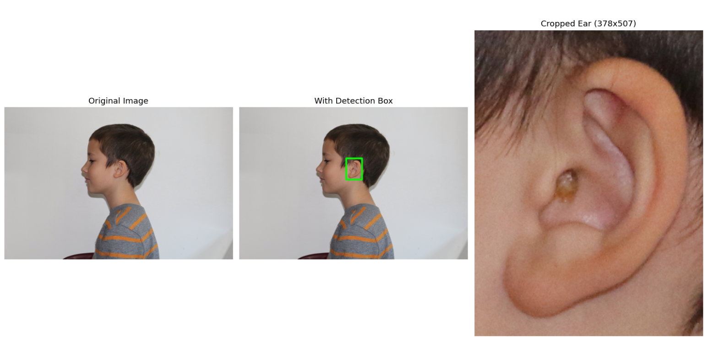

# Ear Detection Using YOLOv5

This repository provides a complete pipeline to detect and crop ear regions from profile face images using a YOLOv5 model trained on custom-annotated ear data.



---

## 🎯 Goal & Output

The goal is to detect human **ears** in profile images using a fine-tuned YOLOv5 model and automatically **crop** the detected regions. This tool helps extract clean ear crops for downstream biometric or medical analysis.

Each image is processed to produce:
- A cropped ear image (JPEG)
- Bounding box selection (best-confidence or all boxes)

---

## 🛠️ Setup Instructions

### 1. Clone YOLOv5 repository

```bash
git clone https://github.com/ultralytics/yolov5.git
```

### 2. Place model and scripts

Copy your trained model file `model.pt` to the `yolov5` folder.  
Also place the `ear_detection.py` script inside the same folder or a subfolder like `src/`.

Your folder structure should look like:

```
yolov5/
├── ear.pt
├── src/
│   └── ear_detection.py
```

### 3. Modify script paths

Edit the following lines in `ear_detection.py` to point to your folders:

```python
INPUT_DIR     = r'path\to\ear\image'     # input images
OUTPUT_DIR    = r'path\to\ear\crops'     # cropped output
YOLOV5_REPO   = r'path\to\yolov5'         # yolov5 cloned repo
MODEL_PATH    = r'path\to\ear.pt'         # trained model
```

### 4. Run detection

```bash
python src/ear_detection.py
```

Cropped ear images will be saved to your `OUTPUT_DIR`.

---

## 🧾 Requirements

Install the dependencies with:

```bash
pip install -r requirements.txt
```

Ensure your environment has:
- Python 3.8+
- PyTorch (CUDA enabled recommended)
- OpenCV
- YOLOv5 dependencies

---

## 📄 License

This project is licensed under the MIT License. See [LICENSE](LICENSE) for details.
